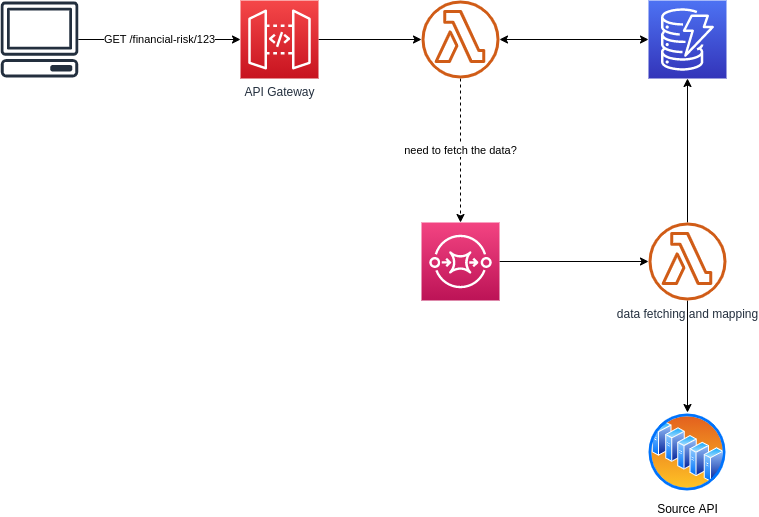

Serverless example
===

REST API with an asynchronous data retrieval and update, written using serverless TypeScript functions.  
Meant to be run on AWS.

# About

Simple API with an individual endpoint returning financial risk information (dummy structure) for a company identified by numeric ID.

For the sake of the example, it is acceptable to return `502` response at first, when there is no data in the table, OR it was fetched more than an hour ago. Nevertheless, a message is sent to SQS and consumed by the second function to fetch the data from an unreliable source and eventually put it in the table, as a background task.

# TODOs (a.k.a. what could be done better)

* tests! (unit and integration)
* add automatic data update with a DynamoDB's [TTL + Streams](https://towardsdatascience.com/how-dynamodb-ttl-enhances-your-serverless-architecture-cdebf7f4a8eb) combo!

# Author

Tomek Marcinkowski  
https://marcinkowski.pl
